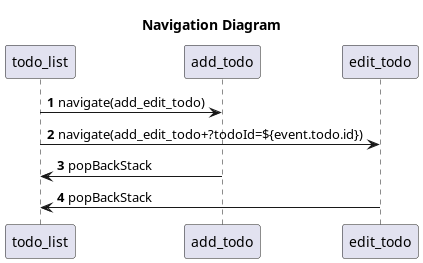
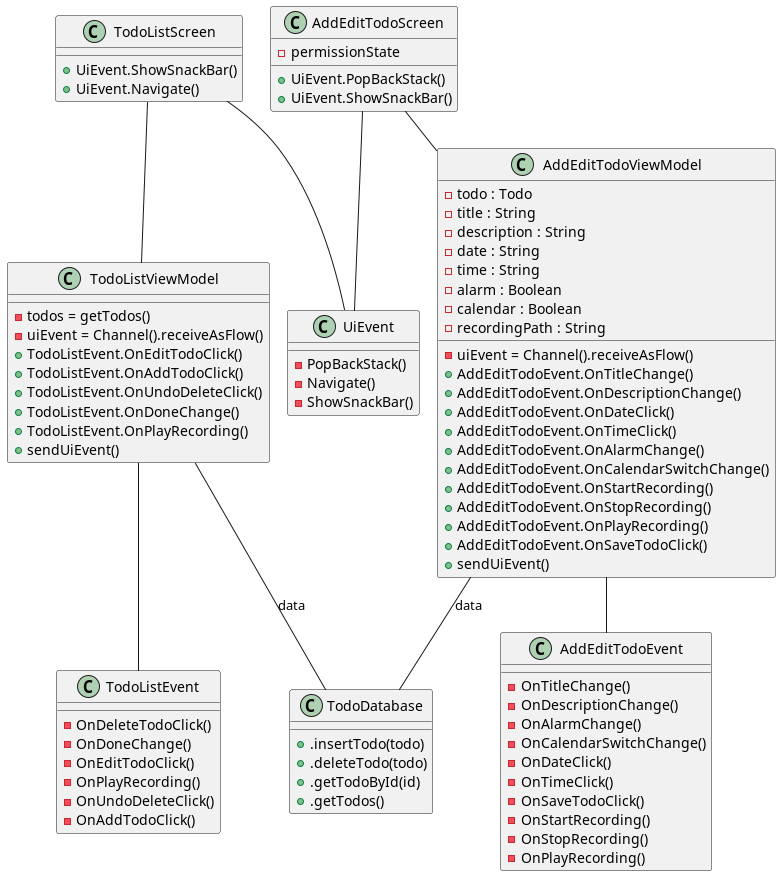

# APPERÓ

Apperó is an app that helps its users annotate tasks they have to do,
with a particular focus on letting them do it as fast as possible,
providing the possibility to attach various types of content
and synchronizing with other applications.  

[Github Repo](https://github.com/LoSpiri/appero)

## Features:
- Saving content rich tasks
- Recording audio attachments
- Setting up notifications
- Setting up calendar events
- Soon to be: Adding tasks to Notion databases

## Navigation:

  
The app is composed of 2 main composables, todo_list and add_edit_todo,
inflated from MainActivity.kt, using Jetpack Compose way of using the navigation component,
meaning without a navigation graph. A NavController is created inside the theme,
from there the NavHost inflates the composables and passes them 
the NavController method they need to navigate, as shown in the image above.
  
I separated add_todo and edit_todo, although they are actually the same composable,
because they are reached using different NavController.navigate strings. Except for this, from both
going back to todo_list is done using the NavController.popBackStack method.

## MVVM:

(Ignore software design conventions)
  
Apperó follow the MVVM architecture, using the 2 composables as views, 
assigning them a viewmodel each and connecting the viewmodels to a database.  
To avoid if conditions here and there and instead group all the logic together,
it uses events, sent and received through channels placed in the viewmodels
and accessed from their respective view to process the event resposnsible for the UI.
The possible events are listed in event classes, with a shared one for the UI ones.  
  

